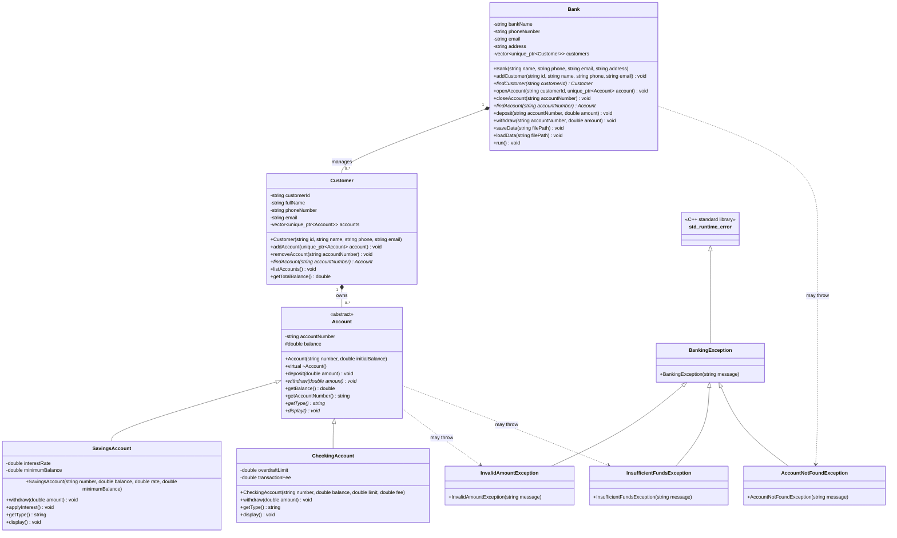

# bank-account-system

OOP II Final Project — Bank Account Manager in C++

## System Architecture & Class Diagram

```mermaid
classDiagram
    direction TB

    class Bank {
        -string bankName
        -string phoneNumber
        -string email
        -string address
        -vector~unique_ptr~Customer~~ customers
        +Bank(string name, string phone, string email, string address)
        +addCustomer(string id, string name, string phone, string email) void
        +findCustomer(string customerId) Customer*
        +openAccount(string customerId, unique_ptr~Account~ account) void
        +closeAccount(string accountNumber) void
        +findAccount(string accountNumber) Account*
        +deposit(string accountNumber, double amount) void
        +withdraw(string accountNumber, double amount) void
        +saveData(string filePath) void
        +loadData(string filePath) void
        +run() void
    }

    class Customer {
        -string customerId
        -string fullName
        -string phoneNumber
        -string email
        -vector~unique_ptr~Account~~ accounts
        +Customer(string id, string name, string phone, string email)
        +addAccount(unique_ptr~Account~ account) void
        +removeAccount(string accountNumber) void
        +findAccount(string accountNumber) Account*
        +listAccounts() void
        +getTotalBalance() double
    }

    class Account {
        <<abstract>>
        -string accountNumber
        #double balance
        +Account(string number, double initialBalance)
        +virtual ~Account()
        +deposit(double amount) void
        +withdraw(double amount)* void
        +getBalance() double
        +getAccountNumber() string
        +getType() string*
        +display() void*
    }

    class SavingsAccount {
        -double interestRate
        -double minimumBalance
        +SavingsAccount(string number, double balance, double rate, double minimumBalance)
        +withdraw(double amount) void
        +applyInterest() void
        +getType() string
        +display() void
    }

    class CheckingAccount {
        -double overdraftLimit
        -double transactionFee
        +CheckingAccount(string number, double balance, double limit, double fee)
        +withdraw(double amount) void
        +getType() string
        +display() void
    }

    class BankingException {
        +BankingException(string message)
    }
    class InvalidAmountException {
        +InvalidAmountException(string message)
    }
    class InsufficientFundsException {
        +InsufficientFundsException(string message)
    }
    class AccountNotFoundException {
        +AccountNotFoundException(string message)
    }
    class std_runtime_error {
        <<C++ standard library>>
    }

    Bank "1" *-- "0..*" Customer : manages
    Customer "1" *-- "0..*" Account : owns
    Account <|-- SavingsAccount
    Account <|-- CheckingAccount

    std_runtime_error <|-- BankingException
    BankingException <|-- InvalidAmountException
    BankingException <|-- InsufficientFundsException
    BankingException <|-- AccountNotFoundException

    Account ..> InvalidAmountException : may throw
    Account ..> InsufficientFundsException : may throw
    Bank ..> AccountNotFoundException : may throw
```
