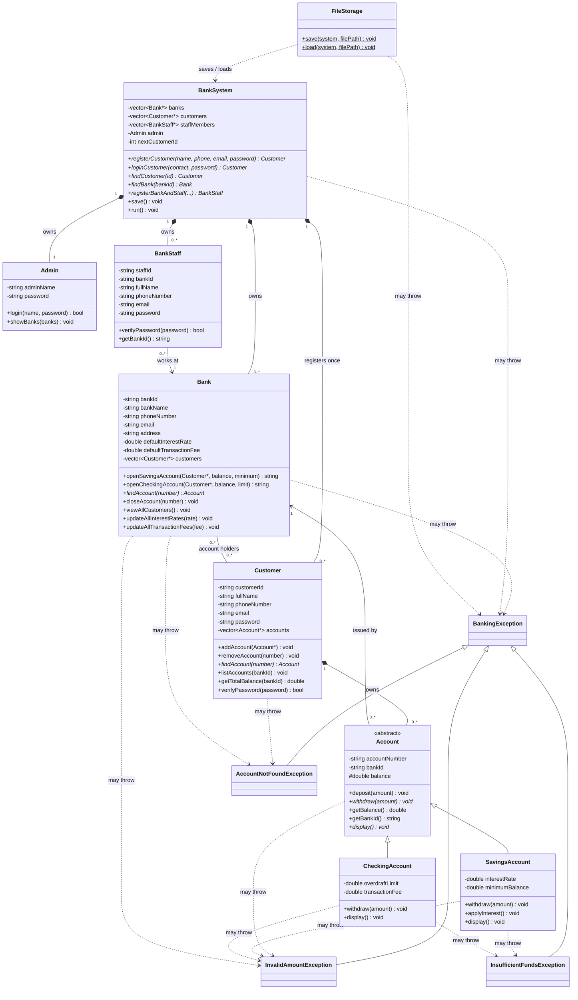

# DEU Bank — C++ Bank Account Manager

OOP II final project. A command-line banking system with savings and checking accounts.

## UML Class Diagram

```mermaid
classDiagram
    direction TB

    class BankSystem {
        -vector~Bank*~ banks
        -vector~Customer*~ customers
        -vector~BankStaff*~ staffMembers
        -Admin admin
        -int nextCustomerId
        +registerCustomer(name, phone, email, password) Customer*
        +loginCustomer(contact, password) Customer*
        +findCustomer(id) Customer*
        +findBank(bankId) Bank*
        +registerBankAndStaff(...) BankStaff*
        +save() void
        +run() void
    }
    class Bank {
        -string bankId
        -string bankName
        -string phoneNumber
        -string email
        -string address
        -double defaultInterestRate
        -double defaultTransactionFee
        -vector~Customer*~ customers
        +openSavingsAccount(Customer*, balance, minimum) string
        +openCheckingAccount(Customer*, balance, limit) string
        +findAccount(number) Account*
        +closeAccount(number) void
        +viewAllCustomers() void
        +updateAllInterestRates(rate) void
        +updateAllTransactionFees(fee) void
    }
    class Customer {
        -string customerId
        -string fullName
        -string phoneNumber
        -string email
        -string password
        -vector~Account*~ accounts
        +addAccount(Account*) void
        +removeAccount(number) void
        +findAccount(number) Account*
        +listAccounts(bankId) void
        +getTotalBalance(bankId) double
        +verifyPassword(password) bool
    }
    class Account {
        <<abstract>>
        -string accountNumber
        -string bankId
        #double balance
        +deposit(amount) void
        +withdraw(amount)* void
        +getBalance() double
        +getBankId() string
        +display()* void
    }
    class SavingsAccount {
        -double interestRate
        -double minimumBalance
        +withdraw(amount) void
        +applyInterest() void
        +display() void
    }
    class CheckingAccount {
        -double overdraftLimit
        -double transactionFee
        +withdraw(amount) void
        +display() void
    }
    class Admin {
        -string adminName
        -string password
        +login(name, password) bool
        +showBanks(banks) void
    }
    class BankStaff {
        -string staffId
        -string bankId
        -string fullName
        -string phoneNumber
        -string email
        -string password
        +verifyPassword(password) bool
        +getBankId() string
    }
    class FileStorage {
        +save(system, filePath)$ void
        +load(system, filePath)$ void
    }
    class BankingException
    class InvalidAmountException
    class InsufficientFundsException
    class AccountNotFoundException

    BankSystem "1" *-- "1..*" Bank : owns
    BankSystem "1" *-- "0..*" Customer : registers once
    BankSystem "1" *-- "0..*" BankStaff : owns
    BankSystem "1" *-- "1" Admin : owns
    Bank "0..*" -- "0..*" Customer : account holders
    Customer "1" *-- "0..*" Account : owns
    Account "0..*" --> "1" Bank : issued by
    BankStaff "0..*" --> "1" Bank : works at
    Account <|-- SavingsAccount
    Account <|-- CheckingAccount
    BankingException <|-- InvalidAmountException
    BankingException <|-- InsufficientFundsException
    BankingException <|-- AccountNotFoundException
    FileStorage ..> BankSystem : saves / loads

    %% Exception dependencies in the updated system
    Account ..> InvalidAmountException : may throw
    SavingsAccount ..> InvalidAmountException : may throw
    SavingsAccount ..> InsufficientFundsException : may throw
    CheckingAccount ..> InvalidAmountException : may throw
    CheckingAccount ..> InsufficientFundsException : may throw
    Customer ..> AccountNotFoundException : may throw
    Bank ..> InvalidAmountException : may throw
    Bank ..> AccountNotFoundException : may throw
    Bank ..> BankingException : may throw
    BankSystem ..> BankingException : may throw
    FileStorage ..> BankingException : may throw

```
